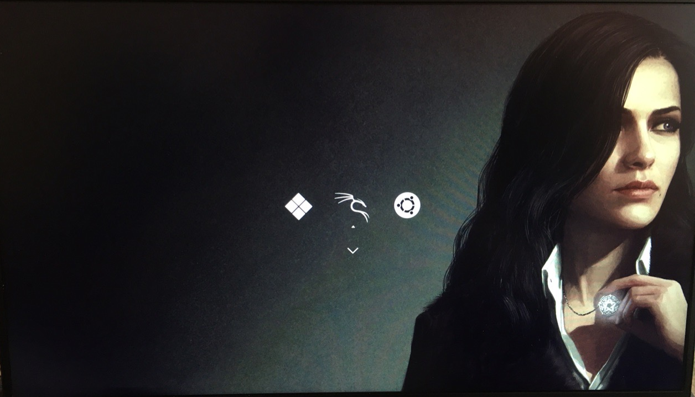

## Minimalistic black rEFInd theme with Yennefer background

[rEFInd](http://www.rodsbooks.com/refind/) is a simplistic boot manager for UEFI
based systems. This is a clean and minimal black theme for it.

### Usage

 1. Locate your refind EFI directory. This is commonly `/boot/EFI/refind`
    though it will depend on where you mount your ESP and where rEFInd is
    installed. `fdisk -l` and `mount` may help.

 2. Clone this repository into the `refind` directory.

 3. To enable the theme add `include redind-minimal-black/theme.conf` at the end of
    `refind.conf`.

### Sources:

https://github.com/andersfischernielsen/rEFInd-minimal-black
https://github.com/munlik/refind-theme-regular

[icons]: http://sworiginal.deviantart.com/art/Lightness-for-burg-181461810
[icon-author]: http://sworiginal.deviantart.com/

[padster]: https://github.com/theRealPadster
